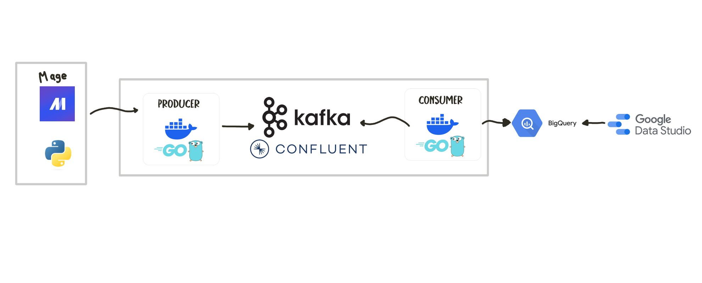

# Course Project
The goal of this project is create a streaming pipeline using Kafka, use a producer server to send to kafka, a consumer to pull the data from kafka, insert to biqquery and get isnights in the Looker Studio.

you can check the final dashboard in the following link below:

- [dashboard](https://lookerstudio.google.com/reporting/e69fe650-6271-4d66-a49f-b3fa27d35f0b)

At the beginning I was using `https://www.kaggle.com/datasets/arshkon/linkedin-job-postings` this dataset for my project but after realizing that it was not aligned with my project I decided to changed for a fake-api-client(I explain all this in my video, if you have time to watch it would be better)

## Technologies
- Cloud: GCP
- IaC: Terraform to deploy mage and Google Run(but not mainly used after the changes)
- Data Warehouse: Bigquery
- Streaming processing: Kafka
   - Go for producer and consumer

- if you want a video explanation of my project you can check this if you want i have a longer and short video: 
   - [Long video](https://youtu.be/ew60vz1s5RQ?si=8A1q_rEBghHUmOYn)
   - [short video](https://youtu.be/0Di1d44SHeA?si=4iakH_luXfY4v_wj)

Diagram

## FLOW

1. **Generating fake data**:
   - using a faker library of python to generate fake data
   - send this fake data to golang server

2. **Sending Data to Kafka**:
   - The golang server use the data from the python script
   - use data data received and convert it to json format
   - send to kafka cluster

3. **Consuming Data from Kafka**:
   - The consumer pulls all the messages from kafka
   - convert that data to Bigquery schema
   - insert the data to Bigquery

4. **Dashboard**:
   - We use Data Studio Looker to connect to the BigQuery tables containing the aggregated insights.
   - Top 10 most in-demand skills (based on frequency of skills in job postings)
   - Top 10 highest paying industries (based on median salary for each industry)
   - Top 10 companies with the most job postings (based on count of job postings per company)
   - Top cities and states with the most job postings (based on count of job postings per city and state)

# Replication

## Clone this repo
- you need to update the files inside the producer and consumer-bq folders
- first we need a google cloud account
- second you need a confluent account
- finally get the all auth files from both
- I will leave you a detailed steps for this

## Google cloud account and BigQuery
I am asuming that you have a Google cloud account so you can now create a BigQuery dataset and table
1. **Sign in to Google Cloud Console:**
   - Go to the Google Cloud Console website: [https://console.cloud.google.com/](https://console.cloud.google.com/)
   - Sign in using your Google account. If you don't have a Google account, you'll need to create one.

2. **Create a New Project:**
   - If you're not already in a project, click on the project name at the top of the page.
   - Click on the dropdown menu next to the project name and select "New Project".
   - Enter a name for your project and click "Create". The project ID will be generated automatically based on the project name.

3. **Enable the BigQuery API:**
   - Once your project is created, click on the navigation menu (☰) in the upper-left corner of the Google Cloud Console.
   - Navigate to "APIs & Services" > "Library" using the left sidebar menu.
   - In the search bar, type "BigQuery" and select "BigQuery API" from the list of results.
   - Click on the "Enable" button to enable the BigQuery API for your project.

4. **Create a BigQuery Dataset:**
   - After enabling the BigQuery API, navigate to "BigQuery" using the left sidebar menu.
   - Click on the project name dropdown at the top of the page and select your newly created project.
   - Click on the "Create dataset" button.
   - Enter a name for your dataset, choose your preferred location, and click "Create dataset". This dataset will be used to store your BigQuery tables.

5. **(Optional) Create a BigQuery Table:**
   - For this case we define a simple schema for the insights like: Category, Count, Name
   - Click on the "Create table" button.
   - Enter the table name, define the schema (columns and data types), and configure any additional settings as needed.
   - Click "Create table" to create the table within your dataset.

6. **Set Up Authentication (Service Account):**
   - To authenticate your Go application with Google Cloud services like BigQuery, you'll need to create a service account and download its key file.
   - Navigate to "IAM & Admin" > "Service accounts" using the left sidebar menu.
   - Click on the "Create service account" button.
   - Enter a name for your service account, specify the role (e.g., BigQuery Admin, BigQuery Data Editor) depending on your requirements, and click "Create".
   - Once the service account is created, click on it from the list of service accounts.
   - Click on the "Add key" dropdown and select "Create new key".
   - Choose the key type (JSON is recommended) and click "Create". This will download the key file to your computer.

7. **Use the Project ID and Service Account Key in the Application:**
   - In the Go application, use the project ID of your newly created project when initializing the BigQuery client.
   - Use the service account key file to authenticate your application with Google Cloud services. Set the `GOOGLE_APPLICATION_CREDENTIALS` environment variable to point to the location of the key file on your system.

## Confluent account
You need a confluent account to create a kafka cluster.

- you need to setup client.properties file inside the producer and consumer-bq folder
- you need to go to the [this link](https://confluent.cloud/environments/env-mkj6r1/clusters/lkc-8yv5d5/clients/new) and choose Golang and follow the steps provided by confluent:

## after get all auth credentials from confluent and Bigquery

- udpate the files inside the producer and consumer-bq folders
- udpate `client.properties` file in both folders
- add your json bigquery credentials inside consumer-bq folder
- update the path names for your json file in my case was `copper-stacker-411515-a77e011c07dd.json`
- you will have a similar file. <project_id>-<411515>-<a77e011c07dd>.json

Finally if all was setup correctly you can use `docker-compose up --build` but if you want to test each one you can use:

- producer/
   - docker build -t my-producer .
   - docker run -p 8080:8080 my-producer

- consumer-bq/
   - docker build -t my-consumer .
   - docker run my-consumer

- fake-api-client/
   - docker build -t fake-api-client .
   - docker run fake-api-client

with luck it is working so if you need more help I made a video so you can guide with that also:
- [Video](https://youtu.be/ew60vz1s5RQ?si=8A1q_rEBghHUmOYn)

# Conclusion 
## Fun fact
When I was testing kafka with confluent I dont know why I thought it would be funny send 100000 concurrent requests to the producer. my machine stop working haha, lesson learned so that is why i just producing data by hour xD)

I learned new thing in this bootcamp and I aprreciate so much to the instructors and all his experience and knowledge that they sharing with us for free. This would be the first step for me and my next projects that I will make. I am not a professional yet so I will keep learning. If you reach until here thanks for reading me.